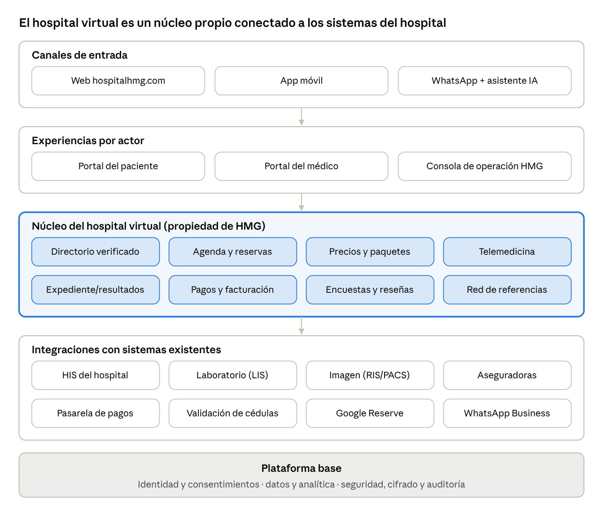

> **Nota de archivo (agregada al incorporar este documento al repositorio, 2026-09-28):**
> Este es el whitepaper de arquitectura, diseño y desarrollo para la visión de largo plazo de `hospitalhmg.com` como **hospital virtual completo** (directorio verificado, agenda, precios cerrados por padecimiento, telemedicina, expediente, pagos, referencias, ranking transparente, asistente de IA de orientación, portal médico y consola de operación HMG).
> **Estado:** documento de roadmap/visión — describe funcionalidad futura a construir, no el estado actual desplegado en producción. El sitio público actual (`hospitalhmg-homepage/index.html`) implementa un subconjunto inicial (directorio básico por especialidad + LINA). Este documento es la referencia de arquitectura para las siguientes fases.
> Fuente original: `Untitled.docx` (autor: Manuel Cadena, 27-sep-2026). Copia editable en `DOCUMENTO_MAESTRO_HOSPITALHMG_HOSPITAL_VIRTUAL.docx` en esta misma carpeta; imágenes en `media/`.

# Documento Maestro hospitalhmg.com --- Hospital Virtual HMG

Sep 27, 2026 · \@Manuel Cadena

hospitalhmg.com debe ser un hospital virtual: un solo lugar donde el
paciente encuentra un médico verificado, conoce el precio total,
reserva, se atiende y da seguimiento, sin salir del ecosistema HMG. Es
gratis para el médico licenciatario; HMG captura valor en los servicios
hospitalarios, de diagnóstico y de la Torre Médica.

## 1. Propuesta de valor

La plataforma resuelve tres problemas a la vez: al paciente le quita la
incertidumbre de calidad y precio; al médico le da pacientes y prestigio
sin costo; a HMG le trae flujo a sus servicios.

  ------------------------------------------------------------------------
  Actor             Problema hoy      Lo que             Por qué no lo da
                                      hospitalhmg.com le Doctoralia
                                      da                 
  ----------------- ----------------- ------------------ -----------------
  Paciente          No sabe si el     Médico verificado  Es directorio y
                    médico es bueno   por un hospital,   agenda; no opera
                    ni cuánto pagará  satisfacción con   laboratorio,
                    en total          muestra grande,    imagen ni
                                      precio cerrado por quirófano
                                      padecimiento, todo 
                                      el episodio en un  
                                      lugar              

  Médico            Paga por          Visibilidad por    Su negocio es
  licenciatario     visibilidad (plan mérito, gratis;    cobrarle al
                    VIP \$2,970 + IVA aval de marca HMG; médico la
                    al mes) y sufre   referencias de la  visibilidad
                    reseñas de        red; agenda y      
                    muestras pequeñas herramientas       

  HMG               Pacientes         Demanda propia     ---
                    captados por      para consultorios, 
                    terceros          laboratorio,       
                                      imagen, cirugía y  
                                      hospitalización;   
                                      datos de calidad   
                                      propios            
  ------------------------------------------------------------------------

**Posicionamiento propuesto:** "El hospital que ya te conoce antes de
llegar". El diferenciador no es tener más médicos que Doctoralia, sino
ser el único directorio respaldado por un hospital que responde por lo
que muestra.

## 2. Principios de diseño

Cada principio responde a un hueco documentado de los portales actuales;
la evidencia está en Fuentes.

  -----------------------------------------------------------------------
  \#                Hueco documentado Principio de      Decisión concreta
                                      diseño            
  ----------------- ----------------- ----------------- -----------------
  P1                Las estrellas no  Mostrar calidad   Credenciales
                    predicen calidad  objetiva, no solo verificadas
                    clínica (β ≈ 0 en opinión           (cédula SEP,
                    5 plataformas;                      consejo de
                    sin correlación                     especialidad),
                    con mortalidad, P                   años de práctica,
                    = .13)                              volumen de
                                                        procedimientos en
                                                        HMG

  P2                Mediana de 4      Confiabilidad     No mostrar
                    reseñas por       estadística       calificación con
                    médico;           visible           n \< 15; mostrar
                    correlación                         n e intervalo de
                    online vs.                          confianza;
                    encuesta interna                    encuesta
                    rho = .23                           post-consulta
                                                        propia a todos
                                                        los pacientes

  P3                92% quiere saber  Precio total      Precio de
                    su costo antes;   antes de decidir  consulta
                    México paga 39%                     obligatorio en el
                    de su salud de                      perfil; paquetes
                    bolsillo vs. 19%                    de precio cerrado
                    OCDE                                por padecimiento

  P4                El orden pagado   Orden neutral y   Fórmula de
                    es un sesgo del   explicado         ranking pública
                    modelo de negocio                   (sección 5); lo
                                                        patrocinado, si
                                                        existe,
                                                        etiquetado

  P5                Los portales      Episodio completo Estudios,
                    terminan en la                      cirugía,
                    cita                                hospitalización y
                                                        seguimiento en la
                                                        misma cuenta del
                                                        paciente

  P6                Médicos: 62% ve   Justicia para el  Solo reseñas de
                    errores en su     médico            pacientes con
                    perfil; 78% teme                    cita verificada;
                    estrés por                          derecho de
                    comentarios                         respuesta;
                                                        mediación HMG
                                                        antes de publicar
                                                        quejas graves

  P7                Exclusividad y    Sin candados      Licencia gratuita
                    venta atada                         y no exclusiva;
                    (multa a                            el médico puede
                    Doctolib, €4.665                    estar también en
                    M)                                  otros portales
  -----------------------------------------------------------------------

## 3. Arquitectura funcional

El núcleo (directorio, agenda, precios, telemedicina, expediente, pagos,
encuestas y referencias) es propiedad de HMG; todo lo demás se conecta a
él.

{width="6.0in"
height="5.205356517935258in"}

arquitectura funcional · 5 capas

Se lee de arriba abajo: el paciente entra por cualquier canal, cada
actor tiene su portal, y el núcleo usa los sistemas que el hospital ya
opera en lugar de duplicarlos.

## 4. Módulos y atributos

El MVP (fase 1) cubre los huecos P1, P2, P3, P4 y P6; el episodio
completo (P5) llega en la fase 2 porque depende de integrar laboratorio,
imagen y el sistema del hospital.

  -------------------------------------------------------------------------
  Módulo            Atributos clave     Principio         Fase
  ----------------- ------------------- ----------------- -----------------
  Directorio        Perfil con cédula y P1                1
  verificado        certificación de                      
                    consejo validadas,                    
                    sello                                 
                    "Licenciatario                        
                    verificado HMG",                      
                    especialidad,                         
                    idiomas, seguros                      
                    aceptados,                            
                    ubicación en Torre                    
                    Médica                                

  Buscador y        Búsqueda por        P4                1
  ranking           síntoma,                              
                    especialidad o                        
                    padecimiento;                         
                    filtros por precio,                   
                    disponibilidad y                      
                    seguro; orden con                     
                    fórmula pública                       

  Agenda y reservas Disponibilidad en   ---               1
                    tiempo real,                          
                    reserva en 3 pasos,                   
                    recordatorios por                     
                    WhatsApp, lista de                    
                    espera,                               
                    reprogramación                        

  Precios y         Precio de consulta  P3                1 (consulta) / 2
  paquetes          obligatorio;                          (paquetes)
                    paquetes cerrados                     
                    (p. ej., cirugía +                    
                    hospitalización +                     
                    estudios) con lo                      
                    que incluye y lo                      
                    que no                                

  Encuestas y       Encuesta a cada     P2, P6            1
  reseñas           paciente atendido;                    
                    calificación                          
                    visible solo con n                    
                    ≥ 15, con n e                         
                    intervalo; reseñas                    
                    solo de citas                         
                    verificadas;                          
                    respuesta del                         
                    médico                                

  Telemedicina      Videoconsulta       ---               2
                    segura, receta                        
                    electrónica, envío                    
                    de estudios                           

  Expediente y      Resultados de       P5                2
  resultados        laboratorio e                         
                    imagen en la cuenta                   
                    del paciente,                         
                    historial de citas,                   
                    documentos                            

  Pagos y           Pago en línea,      P3                2
  facturación       anticipo de                           
                    paquetes, CFDI                        
                    automático, meses                     
                    sin intereses                         

  Red de            Un médico refiere a P5                2
  referencias       otro de la red o a                    
                    estudios HMG con un                   
                    clic; seguimiento                     
                    del paciente                          
                    referido                              

  Asistente IA de   Pregunta de         ---               3
  orientación       síntomas y sugiere                    
                    especialidad y                        
                    urgencia; no                          
                    diagnostica; deriva                   
                    a urgencias si hay                    
                    señales de alarma                     

  Resultados        Volumen de          P1                3
  clínicos          procedimientos y,                     
                    cuando la muestra                     
                    lo permita,                           
                    indicadores                           
                    ajustados por                         
                    riesgo                                

  Portal del médico Perfil, agenda,     P6                1--3
                    analítica de                          
                    visitas, reseñas                      
                    con respuesta,                        
                    referencias                           
                    recibidas, notas                      
                    con IA                                

  Consola de        Alta y verificación ---               1
  operación HMG     de médicos,                           
                    moderación de                         
                    reseñas, gestión de                   
                    paquetes y precios,                   
                    pruebas de uso de                     
                    marca del contrato                    
  -------------------------------------------------------------------------

## 5. Ranking transparente

El orden del directorio se calcula con una fórmula pública en la que el
pago no interviene; los pesos son una propuesta inicial que debe
calibrarse con el estudio conjoint (sección 14).

\\text{Puntaje} = 0.30\\,C + 0.25\\,S + 0.20\\,D + 0.15\\,R + 0.10\\,P

  -----------------------------------------------------------------------
  Componente                          Qué mide (escala 0 a 1)
  ----------------------------------- -----------------------------------
  C --- Credenciales                  Cédula de especialidad validada,
                                      certificación de consejo vigente,
                                      años de práctica

  S --- Satisfacción ajustada         Promedio bayesiano de la encuesta
                                      propia (abajo); evita que un médico
                                      con 2 reseñas de 5 estrellas supere
                                      a uno con 200 de 4.8

  D --- Disponibilidad                Días hasta la primera cita libre,
                                      invertidos y normalizados

  R --- Relevancia                    Coincidencia con la búsqueda:
                                      especialidad, padecimiento,
                                      ubicación, seguro

  P --- Perfil completo               Precio publicado, foto, horarios,
                                      seguros; premia la transparencia
  -----------------------------------------------------------------------

La satisfacción se ajusta por tamaño de muestra, con m = 15 respuestas
de peso previo (el umbral que recomienda Okike 2019) y μ = promedio de
toda la red:

S = \\frac{n\\,\\bar{x} + m\\,\\mu}{n + m}

**Reglas públicas:** el pago no cambia el orden; si en el futuro hay
espacios patrocinados, van fuera de la lista orgánica y etiquetados; la
fórmula se publica en una página "Cómo ordenamos a los médicos".

## 6. Recorrido del paciente

El paciente no sale de HMG entre la búsqueda y el seguimiento; el paso 5
es donde el hospital recupera la inversión en la plataforma.

{width="6.0in"
height="3.401784776902887in"}

recorrido del paciente · 7 pasos, 1 decisión

Meta de diseño: de la búsqueda a la cita confirmada en 3 pantallas o
menos. Cada consulta genera una encuesta que alimenta el ranking de la
siguiente búsqueda.

## 7. Diseño e identidad

La plataforma usa la identidad ya definida en la ficha de licencia:
turquesa #4C8C9C, gris #74767B, tipografía geométrica y el aviso
comercial "Cerca de ti, cerca de todos".

  -----------------------------------------------------------------------
  Elemento                            Especificación
  ----------------------------------- -----------------------------------
  Paleta                              Turquesa #4C8C9C (acción y marca),
                                      gris #74767B (texto secundario),
                                      tinta #2F3336, fondos claros
                                      #EAF3F5; modo oscuro equivalente

  Tipografía                          Títulos geométricos (Century Gothic
                                      o Montserrat en web); cuerpo sans
                                      legible de 16 px mínimo

  Sello de confianza                  "Licenciatario verificado HMG" en
                                      perfil, con fecha de última
                                      verificación y enlace a la cédula
                                      en el registro de la SEP

  Tarjeta de médico                   Foto, especialidad, sello,
                                      satisfacción con n visible, precio
                                      de consulta, próxima cita libre,
                                      botón "Reservar"

  Accesibilidad                       Contraste WCAG 2.2 AA, navegación
                                      por teclado, textos alternativos,
                                      lectura clara para adultos mayores

  Móvil primero                       Diseño para teléfono antes que
                                      escritorio; reserva completa sin
                                      salir de WhatsApp como canal
                                      alterno

  Lenguaje                            Español llano, sin jerga médica en
                                      la navegación; inglés como segundo
                                      idioma

  Uso de marca                        Conforme al Anexo B del contrato de
                                      licencia: tamaño mínimo 120 px,
                                      espacio libre, datos del médico
                                      separados del logotipo
  -----------------------------------------------------------------------

## 8. Arquitectura técnica, datos y seguridad

Propuesta de pila tecnológica convencional y mantenible, apta para
construirse con asistentes de código; es una recomendación, no una
decisión tomada.

  -----------------------------------------------------------------------
  Capa                    Propuesta               Razón
  ----------------------- ----------------------- -----------------------
  Web y app               Next.js (React) con     Un solo lenguaje para
                          diseño responsivo; app  web y móvil; buen SEO
                          móvil en React Native   para el directorio
                          en fase 2               

  API y lógica            TypeScript (Node) o     Separa directorio,
                          Python (FastAPI),       agenda, pagos y
                          servicios por módulo    expediente para crecer
                          del núcleo              por partes

  Base de datos           PostgreSQL con          Datos relacionales;
                          seguridad por fila      control de acceso en la
                          (cada médico ve solo lo base, no solo en la app
                          suyo)                   

  Interoperabilidad       HL7 FHIR R4 para citas, Estándar para conectar
                          resultados y documentos laboratorio, imagen y
                                                  el sistema del hospital

  Búsqueda                Motor de búsqueda con   La búsqueda por síntoma
                          sinónimos médicos en    es la puerta de entrada
                          español ("dolor de      
                          pecho" → cardiología)   

  IA                      Modelo de lenguaje para Reduce riesgo clínico y
                          orientación y notas,    legal
                          con reglas de alarma    
                          fijas y sin diagnóstico 

  Seguridad               TLS en tránsito,        Los datos de salud son
                          cifrado en reposo,      datos personales
                          doble factor para       sensibles
                          médicos y personal,     
                          bitácora de accesos     
                          inmutable, respaldos    
                          diarios                 

  Analítica               Almacén de datos        Medir sin exponer al
                          separado del operativo, paciente
                          con datos               
                          seudonimizados          
  -----------------------------------------------------------------------

**Datos que la plataforma genera y que ningún portal tiene:**
satisfacción con muestra completa, tasa de conversión de consulta a
estudio o cirugía, tiempos reales de espera y volumen por procedimiento.
Son el activo que diferencia a HMG.

## 9. Marco legal y trámites en México

**Veredicto: sí es legal operar consultas por web y videollamada,
referir especialistas y hacer un triage inicial con IA, con cuatro
condiciones:** (1) cada servicio remoto debe colgar de un
establecimiento físico autorizado y de médicos con cédula; (2) la IA
orienta y deriva, no diagnostica ni prescribe; (3) la publicidad en la
web se notifica o se autoriza ante COFEPRIS; (4) los datos de salud se
tratan con consentimiento expreso. No existe en la ley la figura de
"hospital virtual"; es una marca comercial de servicios del hospital
HMG.

### 9.1 Normas aplicables (verificadas)

  -----------------------------------------------------------------------------------------------------------------------------------------------------------------------------------------
  Norma                                                                                                                                     Qué exige               Efecto en Hospital
                                                                                                                                                                    Virtual HMG
  ----------------------------------------------------------------------------------------------------------------------------------------- ----------------------- -----------------------
  [Ley General de Salud, Cap. VI Bis "Salud Digital", arts. 71 Bis--71 Octies](https://dof.gob.mx/2026/PRESREP/PRESREP_150126_02.pdf) (DOF  Define telesalud y      Base legal expresa de
  15-ene-2026)                                                                                                                              telemedicina; art. 71   la telemedicina; la
                                                                                                                                            Septies: personal       Secretaría de Salud
                                                                                                                                            capacitado, sistemas    emitirá lineamientos
                                                                                                                                            que garanticen          (plazo de 90 días del
                                                                                                                                            confidencialidad e      transitorio quinto)
                                                                                                                                            integridad,             
                                                                                                                                            consentimiento          
                                                                                                                                            informado y registro de 
                                                                                                                                            la atención             

  LGS art. 198                                                                                                                              Licencia sanitaria      El hospital HMG ya debe
                                                                                                                                            previa para             tenerla; la
                                                                                                                                            establecimientos con    telemedicina se ancla a
                                                                                                                                            actos quirúrgicos u     él
                                                                                                                                            obstétricos             

  LGS arts. 200 y 200 Bis                                                                                                                   Aviso de funcionamiento Cada consultorio de
                                                                                                                                            (gratuito) para         licenciatario lo
                                                                                                                                            consultorios sin        necesita
                                                                                                                                            cirugía                 

  LGS arts. 79 y 83; Reglamento de Publicidad arts. 2, 16, 86 y 87                                                                          Publicidad en cualquier Cada perfil del
                                                                                                                                            medio electrónico,      directorio debe mostrar
                                                                                                                                            incluida la web; debe   esos datos; aviso de
                                                                                                                                            mostrar institución que publicidad 5 días antes
                                                                                                                                            expidió el título,      
                                                                                                                                            cédula y, en su caso,   
                                                                                                                                            especialidad            

  NOM-004-SSA3-2012 y NOM-024-SSA3-2012                                                                                                     Expediente clínico      El módulo de expediente
                                                                                                                                            (físico o electrónico)  debe cumplir ambas
                                                                                                                                            e interoperabilidad y   
                                                                                                                                            seguridad de sistemas   
                                                                                                                                            de información en salud 

  Reglamento de Atención Médica arts. 64--65; Reglamento de Insumos arts. 28--30                                                            Receta con firma        Receta electrónica solo
                                                                                                                                            autógrafa o electrónica con e.firma del médico
                                                                                                                                            avanzada, cédula y, si  
                                                                                                                                            aplica, registro de     
                                                                                                                                            especialidad            

  [LFPDPPP](https://www.garrigues.com/es_ES/noticia/mexico-nueva-ley-federal-proteccion-datos-personales-posesion-particulares-introduce)   Datos de salud =        Aviso de privacidad
  (DOF 20-mar-2025)                                                                                                                         sensibles;              integral y
                                                                                                                                            consentimiento expreso; consentimiento en el
                                                                                                                                            autoridad: Secretaría   registro del paciente
                                                                                                                                            Anticorrupción y Buen   
                                                                                                                                            Gobierno                

  Ley de Firma Electrónica Avanzada art. 7                                                                                                  Documento con firma     Consentimientos y
                                                                                                                                            avanzada = mismo valor  recetas firmados en
                                                                                                                                            que el autógrafo        línea son válidos
  -----------------------------------------------------------------------------------------------------------------------------------------------------------------------------------------

### 9.2 Triage con IA: permitido, con límites

No hay ley general de IA vigente en México; las iniciativas de 2026
siguen en comisiones ([IT Sitio,
ago-2026](https://www.itsitio.com/mx/inteligencia-artificial/regulacion-de-ia-en-mexico-todavia-no-hay-una-ley-general-pero-las-reglas-ya-avanzan-por-sectores/)).
COFEPRIS no ha emitido una regla final sobre software como dispositivo
médico; su estatus actual debe confirmarse con la autoridad. La
evidencia exige prudencia: en una revisión sistemática, los
verificadores de síntomas acertaron el diagnóstico principal solo
19--37.9% de las veces y el triage 48.8--90.1% ([Wallace et al., *NPJ
Digital
Medicine*](https://consensus.app/papers/details/ac92ae65461c5760a2ece88b4d333043/?utm_source=claude_desktop)).

- La IA sugiere especialidad y nivel de urgencia; nunca emite
  diagnóstico ni receta.

- Reglas fijas de alarma (dolor torácico, dificultad respiratoria, etc.)
  mandan a urgencias antes de cualquier modelo.

- Un médico valida la referencia cuando el caso no es rutinario; el
  paciente sabe que habla con una IA.

- Validación clínica interna antes del lanzamiento y bitácora de cada
  recomendación.

### 9.3 Trámites para lanzar

- [ ] Definir la persona moral operadora con objeto social de servicios
  de salud (New Century Real Estate tiene objeto de licencias de marca,
  no de atención médica)

- [ ] Confirmar licencia sanitaria vigente del hospital HMG y aviso de
  responsable sanitario; incorporar la telemedicina como servicio del
  establecimiento

- [ ] Aviso de funcionamiento (COFEPRIS-05-018, gratuito) de cada
  consultorio licenciatario

- [ ] Aviso de publicidad por médico (COFEPRIS-02-002-A, gratuito, vía
  DIGIPRiS con e.firma) y permiso de publicidad del establecimiento si
  aplica (una guía privada reporta \$44,252.23 por mensaje en 2026;
  verificar en la Ley Federal de Derechos)

- [ ] Aviso de privacidad integral, consentimiento expreso de datos de
  salud y términos y condiciones

- [ ] Consentimiento informado específico de telemedicina (art. 71
  Septies)

- [ ] Expediente electrónico conforme a NOM-004 y NOM-024; e.firma de
  médicos para recetas

- [ ] Consulta formal a COFEPRIS sobre la clasificación del módulo de
  triage con IA

- [ ] IMPI: inscribir las licencias (cláusula Décima Cuarta) y evaluar
  registrar "Hospital Virtual HMG"; los registros actuales en clase 44
  ya amparan "servicios de telemedicina"

- [ ] Seguro de responsabilidad civil profesional (médicos) y de la
  plataforma

### 9.4 Riesgos civiles, mercantiles y penales

  -----------------------------------------------------------------------
  Materia                 Riesgo                  Mitigación
  ----------------------- ----------------------- -----------------------
  Civil                   Responsabilidad por     Términos que separen al
                          daño y daño moral; el   prestador; aviso
                          nombre "Hospital" puede visible de que cada
                          hacer que el paciente   médico es independiente
                          atribuya al hospital el (coherente con la
                          acto de un              cláusula Décima)
                          licenciatario           

  Contrato de licencia    La cláusula Cuarta II   Ajustar la cláusula
                          prohíbe al médico       para permitir el canal
                          ostentarse como         Hospital Virtual con
                          hospital operado por la reglas claras
                          licenciante             

  Consumo y mercantil     Publicidad engañosa o   Precio total con lo que
                          precios incompletos     incluye; conservar
                          ante PROFECO; validez   mensajes de datos
                          de contratos en línea   conforme a
                                                  NOM-151-SCFI-2016

  Sanitario               Multas de LGS arts.     Revisión de cada perfil
                          419--423 por publicidad antes de publicarse
                          sin requisitos,         
                          duplicadas por          
                          reincidencia            

  Penal                   Responsabilidad         Verificar cédula en el
                          profesional y           registro de la SEP
                          usurpación de profesión antes de activar
                          si un perfil no está    cualquier perfil
                          verificado              
  -----------------------------------------------------------------------

**Qué está verificado y qué no:** las normas de 9.1 se revisaron en
fuentes oficiales o de despachos; los artículos del Código Civil Federal
(1910, 1916, 2615) y del Código Penal Federal (228--230, 250) no se
revisaron en esta sesión y se omitieron de la tabla. Todo requiere
validación de un abogado sanitario antes del lanzamiento.

## 10. Modelo de negocio

El médico no paga: HMG subsidia el lado de la oferta y cobra en el
hospital, igual que Doctoralia subsidia al paciente y cobra al médico.

  -----------------------------------------------------------------------
  Fuente de valor         Mecanismo               Fase
  ----------------------- ----------------------- -----------------------
  Servicios hospitalarios Estudios de laboratorio 1
                          e imagen, cirugía y     
                          hospitalización         
                          originados en consultas 
                          de la plataforma        

  Paquetes de precio      Margen del paquete      2
  cerrado                 completo; mejora la     
                          ocupación de quirófanos 

  Torre Médica            Mayor ocupación y renta 1
                          de consultorios por     
                          flujo de pacientes      

  Telemedicina            Cuota por               2
                          videoconsulta,          
                          compartida con el       
                          médico                  

  Convenios con           Red HMG como proveedor  3
  aseguradoras y empresas preferente para         
                          empleados y asegurados  

  Herramientas premium    Notas con IA o          3
  opcionales              campañas, sin efecto en 
                          el ranking              
  -----------------------------------------------------------------------

**Regla de oro:** ninguna fuente de ingreso puede comprar posición en el
directorio; si lo hiciera, se pierde el diferenciador frente a
Doctoralia (principio P4).

## 11. KPIs

Las metas son propuestas para discusión; se fijan con la línea base de
los primeros 90 días de operación.

  -----------------------------------------------------------------------
  KPI                     Definición              Meta propuesta a 12
                                                  meses
  ----------------------- ----------------------- -----------------------
  Médicos verificados     Licenciatarios con      Por definir con el
  activos                 perfil completo y       padrón actual de la
                          agenda abierta          Torre Médica

  Conversión búsqueda →   Citas confirmadas /     Medir línea base y
  cita                    búsquedas con clic en   mejorarla 20%
                          perfil                  

  Tasa de inasistencia    Citas no atendidas /    Bajarla 30% con
                          citas reservadas        recordatorios

  Tasa de respuesta de    Encuestas contestadas / ≥ 40%
  encuesta                consultas atendidas     

  Médicos con n ≥ 15      Porcentaje de perfiles  ≥ 60%
                          con calificación        
                          visible                 

  Derivación a servicios  Consultas que generan   Medir línea base; es el
  HMG                     estudio, cirugía u      KPI financiero
                          hospitalización en HMG  principal

  Ingreso atribuible      Ingreso hospitalario    Cubrir el costo total
                          originado en la         de la plataforma
                          plataforma              

  Seguridad del triage    Casos de alarma no      0
                          derivados a urgencias   
  -----------------------------------------------------------------------

## 12. Hoja de ruta

Se avanza por compuertas, no por fechas: ninguna fase se lanza sin
cumplir la condición anterior.

{width="6.0in"
height="2.267856517935258in"}

hoja de ruta · 4 fases, 3 compuertas

Las fechas se fijan cuando se conozca la capacidad del equipo de
desarrollo y el estado de los trámites de la fase 0.

## 13. Riesgos y mitigaciones

El riesgo mayor no es técnico sino de adopción: sin suficientes médicos
con encuestas, el directorio no se distingue de Doctoralia.

  -----------------------------------------------------------------------
  Riesgo                  Probabilidad            Mitigación
  ----------------------- ----------------------- -----------------------
  Pocos médicos o pocas   Alta                    Arrancar con la Torre
  encuestas (el                                   Médica; encuesta
  directorio se ve vacío)                         automática por WhatsApp
                                                  tras cada cita

  Error del triage con IA Media                   Reglas de alarma fijas,
                                                  validación médica, sin
                                                  diagnóstico (sección
                                                  9.2)

  Reclamo por la promesa  Media                   Agregar cláusula al
  de directorio y                                 contrato de licencia;
  primeros lugares, que                           publicar la fórmula de
  no está en el contrato                          ranking

  Fuga o mal uso de datos Baja, impacto alto      Cifrado, doble factor,
  de salud                                        bitácora, aviso de
                                                  privacidad y
                                                  consentimiento expreso

  Sanción de COFEPRIS por Media                   Revisión de cada
  publicidad                                      perfil; avisos de
                                                  publicidad antes de
                                                  activar

  El médico usa la        Media                   Paquetes y referencias
  plataforma solo para                            que hagan más fácil
  captar y opera fuera de                         quedarse en HMG; sin
  HMG                                             exclusividad forzada
                                                  (P7)
  -----------------------------------------------------------------------

## 14. Preguntas abiertas y fuentes

- [ ] ¿Qué persona moral operará el Hospital Virtual y quién será su
  responsable sanitario?

- [ ] ¿Qué sistemas usa hoy el hospital (HIS, laboratorio, imagen) y
  exponen interfaces para integrarse?

- [ ] ¿Cuántos médicos de la Torre Médica firmarán la licencia en la
  primera ola?

- [ ] Estudio conjoint con pacientes HMG (n ≈ 385 da ±5% con 95% de
  confianza) para calibrar los pesos del ranking y el valor de cada
  atributo

- [ ] Opinión de abogado sanitario sobre el uso del nombre "Hospital
  Virtual", el permiso de publicidad del establecimiento y la
  clasificación del triage con IA

- [ ] Ajustar el contrato de licencia: directorio y ranking como
  obligación de la licenciante, y la cláusula Cuarta II

**Fuentes legales y de mercado**

- [Decreto de reforma a la Ley General de Salud, DOF
  15-ene-2026](https://dof.gob.mx/2026/PRESREP/PRESREP_150126_02.pdf)

- [Secretaría de Salud (DGMOSS): Marco jurídico aplicable a la salud
  digital en México,
  jun-2026](https://dgmoss.salud.gob.mx/dgmoss/uploads/2026-06-03%20MARCO%20JUR%C3%8DDICO%20APLICABLE%20A%20LA%20SALUD%20DIGITAL%20EN%20M%C3%89XICO_compressed.pdf)

- [Garrigues: nueva LFPDPPP
  2025](https://www.garrigues.com/es_ES/noticia/mexico-nueva-ley-federal-proteccion-datos-personales-posesion-particulares-introduce)

- [Hillflare: aviso de publicidad COFEPRIS paso a
  paso](https://hillflare.com/blog/aviso-de-publicidad-cofepris) (guía
  privada)

- [SDV: artículo 198
  LGS](https://sdv.com.mx/compendio/ley-general-de-salud/articulo-198/)
  · [Rivenza: aviso de
  funcionamiento](https://www.rivenza.com.mx/blog/aviso-de-funcionamiento-costo-y-quien-lo-necesita)

- [IT Sitio: estado de la regulación de IA en México,
  ago-2026](https://www.itsitio.com/mx/inteligencia-artificial/regulacion-de-ia-en-mexico-todavia-no-hay-una-ley-general-pero-las-reglas-ya-avanzan-por-sectores/)

- [Doctoralia PRO: precios para
  especialistas](https://pro.doctoralia.com.mx/precios/medicos-y-especialistas)
  · [Autorité de la concurrence: multa a
  Doctolib](https://www.autoritedelaconcurrence.fr/en/press-release/autorite-fines-doctolib-eu4665000-abusing-its-dominant-position-online-medical)
  · [La Jornada: gasto de bolsillo, OCDE
  2025](https://www.jornada.com.mx/2025/11/17/economia/021n2eco)

**Evidencia académica**

- [Daskivich et al. 2018, *JAMIA*: las calificaciones no predicen
  calidad](https://consensus.app/papers/details/279061a2129d506fb6bfe9243b04cdff/?utm_source=claude_desktop)

- [Okike et al. 2016, *JMIR*: sin correlación con
  mortalidad](https://consensus.app/papers/details/14dcf61a83e0524583f3d0afc92265e4/?utm_source=claude_desktop)
  · [Okike et al. 2019, *JGIM*: umbral de 15
  reseñas](https://consensus.app/papers/details/d8f095bf7226549b888201e4730ca808/?utm_source=claude_desktop)

- [Henrikson et al. 2017: 92% quiere conocer su
  costo](https://consensus.app/papers/details/e1db3c89ce2c51afaae78a6334426a6f/?utm_source=claude_desktop)
  · [Mulgund et al. 2020: sesgos del modelo de
  negocio](https://consensus.app/papers/details/6800056e715153849152e5a967ae866d/?utm_source=claude_desktop)

- [Samora et al.
  2015](https://consensus.app/papers/details/72ecc782e001534b8bcdf6c9a29e1eca/?utm_source=claude_desktop)
  · [Holliday et al.
  2017](https://consensus.app/papers/details/9c1a123c9b805aef9eced45133a47f39/?utm_source=claude_desktop):
  percepción de los médicos

- [Wallace et al., *NPJ Digital Medicine*: precisión de verificadores de
  síntomas](https://consensus.app/papers/details/ac92ae65461c5760a2ece88b4d333043/?utm_source=claude_desktop)
